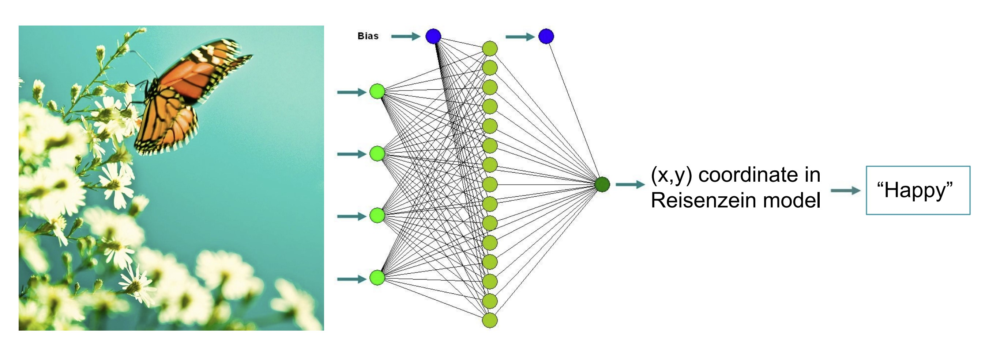

# Art Mood Identifier
**by Team creAItivity - Nathan Wang and Sakshi Kakkad**

### Introduction
In recent years, developments in digital media technologies as well as easy access to content (through social media platforms and other online sources) require developments in data retrieval and processing tools. Images can be categorized by metadata (keywords or tags) or can be retrieved through content-based image retrieval systems, which classify images based on information contained within the images themselves. However, it is still difficult to retrieve and classify images based on variable, “human” characteristics such as emotion.  

### Problem
We propose to train a machine learning model to classify images based on their associated emotions. The ability to classify images in this way would be useful for social media platforms and image retrieval tools, as it would allow access to more relevant digital media through queries made with “human” parameters rather than empirical ones. Social media platforms and marketing agencies can more accurately display and recommend content for users when algorithms are better trained to interpret data qualitatively.  

### Data Collection
We obtained our dataset from a dataset used by Saif Mohammad in WikiArt Emotions: An Annotated Dataset of Emotions Evoked by Art. This dataset contains 4,105 images that were categorized into emotions based off surveys. For our project, we compiled these images under 7 classes: Euphoric, Aggressive, Calm, Euphoric and Calm (E+C), Aggresive and Calm (A+C), Euphoric and Aggressive (A+E), and all emotions present (A+C+E). After organizing the photos into their respective classes, we downloaded all of the images, resized them into 125x125 pixel RGB images, and saved them in Google Drive.

### Methods

### Results
We expect that the inclusion of people in images could skew the results because the model may not pick up on these characteristics. We also expect to see the model categorize images with warmer hues, higher saturation, and a higher value (more bright) as euphoric (quadrant 1 on the Reisenzein model), while images with cooler hues, lower saturation, and lower values will be classified as melancholy (quadrant 3). 

### Future Considerations

### References
1. [Content-based mood classification for photos and music: a generic multi-modal classification framework and evaluation approach](https://dl.acm.org/doi/abs/10.1145/1460096.1460114)
2. [Building Emotional Machines: Recognizing Emotions through Deep Neural Networks](https://arxiv.org/abs/1705.07543)
3. [Image Retrieval by Emotional Semantics: A Study of Emotional Space and Feature Extraction](https://ieeexplore.ieee.org/document/4274431)
4. [Seeing Stars of Valence and Arousal in Blog Posts](https://ieeexplore.ieee.org/document/6365167)
